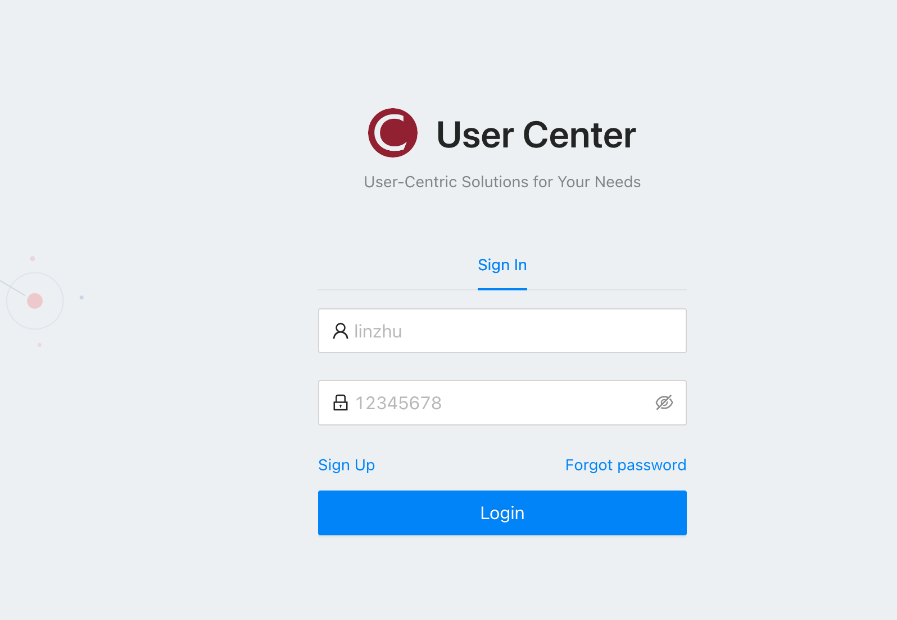
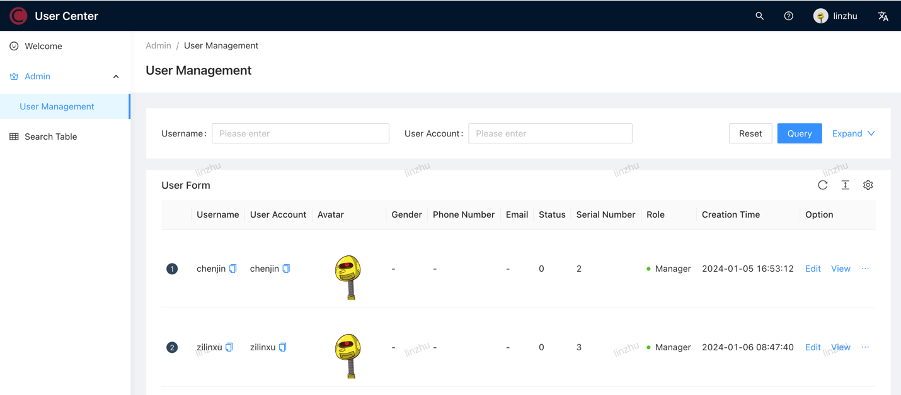

# User-Center Management System

The core [user-centered system](http://user.zilinxu.com/) of the enterprise is a full-stack project based on Spring Boot back-end + React front-end, which implements basic functions such as user registration, login, and query.

**Website:** [user.zilinxu.com](http://user.zilinxu.com/)

## Tech Stack

### Front End
* HTML + CSS + Javascript
* React
* Ant Design Pro project template and component library
* Umi development framework and request library
* Forward and reverse proxies

### Back End
* Java
* Spring + SpringMVC + SpringBoot framework
* Mybatis + MybatisPlus Database access framework
* Mysql Database
* JUnit Test

### Deployment
* Baota Container hosting platform
* Docker
